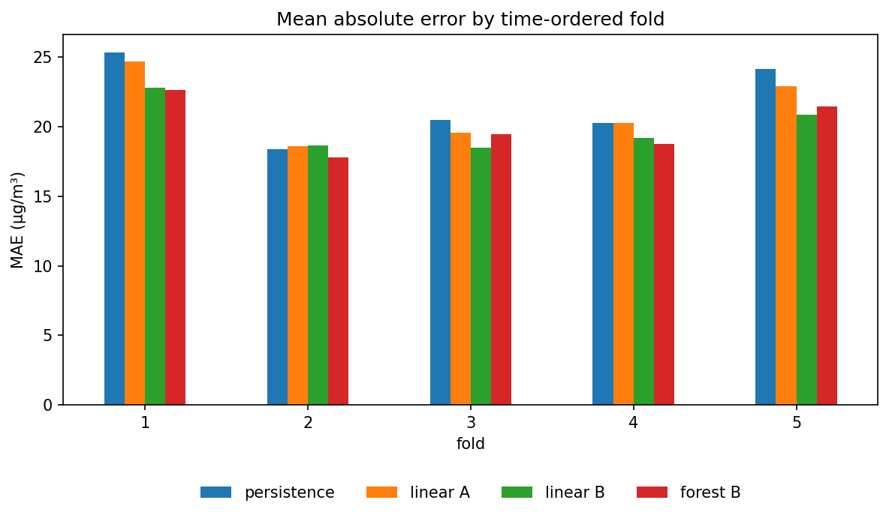
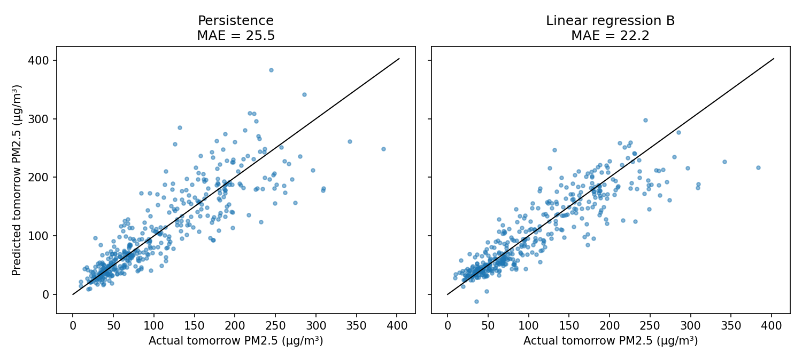
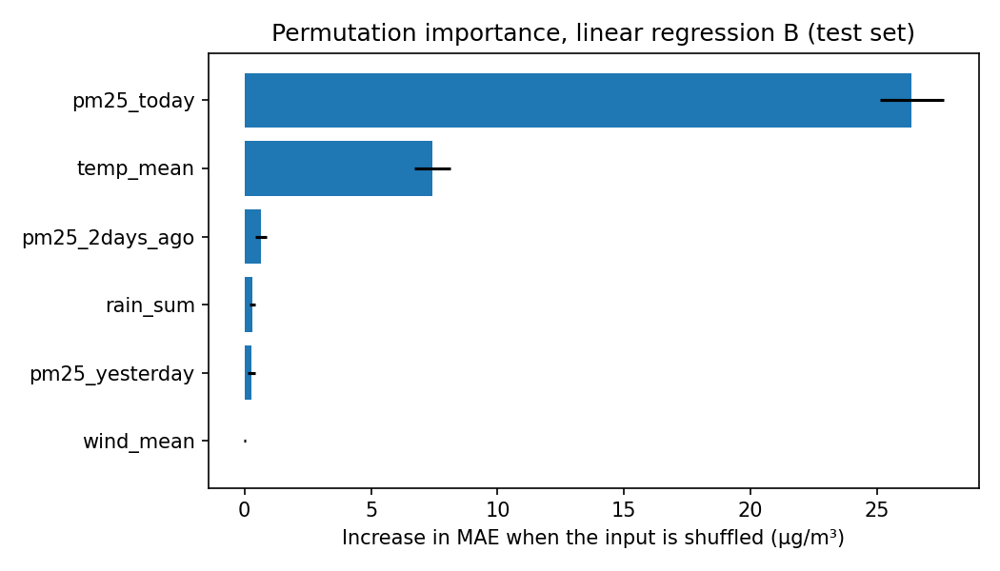

# Dhaka Next-Day PM2.5 Forecasting

Can recent PM2.5 and weather in Dhaka predict tomorrow's average PM2.5 better than simply assuming tomorrow equals today?

This is Project 2 of my data science portfolio. Project 1 ([dhaka-air-quality-eda](https://github.com/mahbubaaktereka/dhaka-air-quality-eda)) explored the same data; this project uses it to build and honestly evaluate a forecast.

## Problem

Air pollution in Dhaka is a public health concern, and a simple next-day forecast is a practical applied-ML task. The question is how much a model adds over the simplest possible forecast.

## Objective

Predict the next day's mean PM2.5 (µg/m³) from today's and the previous two days' PM2.5 and today's weather, and compare against a persistence baseline ("tomorrow = today") using time-ordered evaluation.

## Dataset

Both CSVs were produced in Project 1; source, license notes and credits are in that README.

- **PM2.5:** hourly values from OpenAQ location 8415 (sensor 24434), 66,379 rows, 2016-11-09 to 2025-03-24. 83.5% of hourly slots in that period have a value (61,229 of 73,364).
- **Weather:** hourly ERA5 reanalysis via Open-Meteo, 73,416 rows, 2016-11-09 to 2025-03-25 (temperature_2m, rain, wind_speed_10m).

The raw data is not stored in this repository (`data/raw/` is git-ignored).

## Tools

Python, pandas, NumPy, scikit-learn, matplotlib, Kaggle notebook.

## Methodology

1. Hours are labelled by their start time (`from_local`, Asia/Dhaka).
2. Hourly PM2.5 is averaged into a daily mean. A day counts as valid only if it has at least 18 hourly values; other days are marked missing (not filled). The first and last partial days are dropped.
3. Weather is aggregated to daily: mean temperature, total rain, mean wind speed.
4. Each example uses today's PM2.5, yesterday's, the day before's, and today's weather to predict tomorrow's PM2.5. Examples need all PM2.5 values valid. This gives 1,985 examples.
5. Models: persistence baseline, linear regression, random forest (300 trees, `min_samples_leaf=5`, `random_state=42`, no tuning). Two input sets: **A** = PM2.5 only; **B** = PM2.5 + weather.
6. Evaluation: MAE and RMSE on time-ordered splits only (no random shuffling).

## Preprocessing

| Step | Result |
|---|---|
| Days in range | 3,056 |
| Valid days (>= 18 hours) | 2,444 (80.0%) |
| Invalid days | 612 |
| Valid streaks | 178 (longest 243 days) |
| Examples after requiring 3 days of PM2.5 + target | 1,985 |

## Evaluation

### Single split (80% train / 20% test)

Train: 1,588 examples (2016-11-12 to 2024-01-20). Test: 397 examples (2024-01-21 to 2025-03-22).

| Model | Inputs | MAE | RMSE |
|---|---|---|---|
| Persistence | today's PM2.5 | 25.5 | 36.9 |
| Linear regression | A | 24.1 | 34.7 |
| Random forest | A | 24.6 | 34.9 |
| Linear regression | B | 22.2 | 32.4 |
| Random forest | B | 22.3 | 32.0 |

### Five expanding-window folds (MAE)

| Fold | Test period | Persistence | Linear A | Linear B | Forest B |
|---|---|---|---|---|---|
| 1 | 2019-01-09 to 2020-04-04 | 25.3 | 24.7 | 22.8 | 22.6 |
| 2 | 2020-04-05 to 2021-10-17 | 18.4 | 18.6 | 18.6 | 17.8 |
| 3 | 2021-10-18 to 2023-04-08 | 20.5 | 19.6 | 18.5 | 19.5 |
| 4 | 2023-04-09 to 2024-04-08 | 20.3 | 20.3 | 19.2 | 18.8 |
| 5 | 2024-04-09 to 2025-03-22 | 24.2 | 22.9 | 20.9 | 21.4 |
| **Mean** | | **21.7** | **21.2** | **20.0** | **20.0** |

### Extra checks

- **Season feature** (sin/cos of day of year), mean MAE over the five folds: PM2.5 + season 20.3; B (weather) 20.0; B + season 19.9.
- **Coverage threshold** (minimum valid hours per day), linear model improvement over persistence in mean MAE:

| Min hours | Examples | A vs persistence | B vs persistence |
|---|---|---|---|
| 12 | 2,213 | 3.1% | 8.4% |
| 18 | 1,985 | 2.4% | 8.0% |
| 22 | 1,608 | 1.3% | 5.4% |

### Which inputs matter (permutation importance, test set)

In linear B, shuffling `pm25_today` raises MAE by 26.4 and `temp_mean` by 7.4; the other inputs raise it by less than 1. The random forest gives the same ranking (29.5 and 4.4).

## Findings

> Rewrite these in your own words.

- All models with weather beat persistence in four of five folds; in fold 2 they were about equal (forest B 17.8 vs 18.4).
- Averaged over folds, the best models cut MAE from 21.7 to 20.0 (about 8%). The single-split gap was larger (about 13%), so the five-fold figure is the safer one.
- Adding season, or using a random forest instead of linear regression, changed the mean MAE by 0.1 or less compared with linear B.
- The improvement over persistence varies with the coverage threshold (5.4% to 8.4% for linear B).

## Limitations

- One station in one city; results may not hold elsewhere.
- Evaluation uses a handful of time-ordered splits; consecutive days are strongly related, so 397 test examples are not 397 independent tests, and small differences (for example 20.0 vs 20.0) should not be read as one model being better.
- Linear regression can predict negative PM2.5, which is impossible (seen in the actual-vs-predicted plot).
- `temp_mean` may partly stand in for time of year; adding a season feature did not change MAE much, but this does not prove why temperature is useful.
- Today's, yesterday's and the day before's PM2.5 are strongly related, so shuffling one input at a time understates their individual importance.
- Permutation importance describes the trained model, not cause and effect.
- Days with fewer than 18 hourly values and examples without three valid days of history are excluded; I did not check whether the missing days follow a pattern.
- No hyperparameter tuning, and no prediction intervals.

## Future Work

- Test other stations or cities.
- Check why days are missing and whether that biases the results.
- Try more lags, rolling averages, and gradient boosting.
- Clip predictions at zero or model PM2.5 on a log scale.
- Add prediction intervals.

## How to Run

The notebook `notebooks/dhaka_pm25_forecasting.ipynb` was run on Kaggle with the two CSVs added as inputs. To run it elsewhere:

1. Obtain `pm25_sensor_24434.csv` and `weather_era5_dhaka.csv` as described in the Project 1 README and place them in `data/raw/`.
2. Install pandas, NumPy, scikit-learn and matplotlib.
3. In the notebook, change `PM25_PATH` and `WEATHER_PATH` to your local paths, then run all cells.

## Repository Structure

- `notebooks/` analysis notebook
- `figures/` saved figures
- `data/raw/` raw data (git-ignored, not in the repository)
- `src/` reserved for scripts
